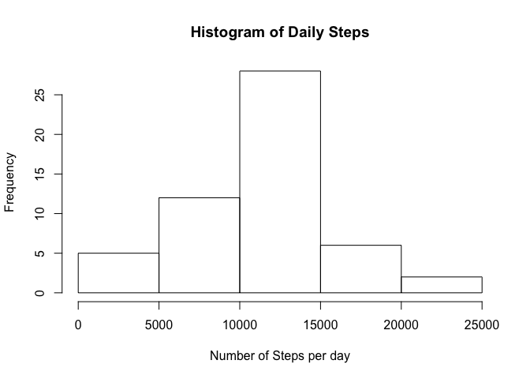
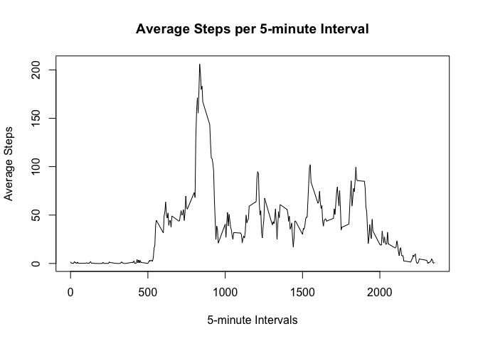
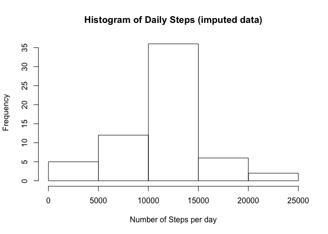
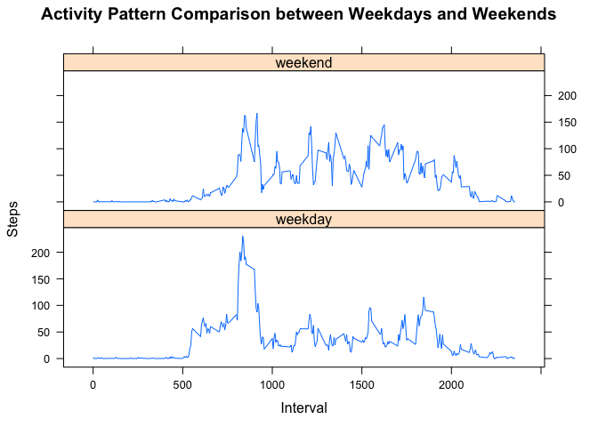

## Loading and preprocessing the data

The following code will read in the activity data file (note that "activity.csv" is already located in the working directory) and convert dates to R's date format.


```r
#read in data
activityData <- read.csv("activity.csv")
#process dates
activityData$date <- as.Date(activityData$date)
```


## What is mean total number of steps taken per day?


```r
#calculate total number of steps each day
sumData <- tapply(activityData$steps, activityData$date, sum)
#create histogram
hist(sumData, xlab="Number of Steps per day", main="Histogram of Daily Steps")
```

<!-- -->


```r
#calculate mean
meanSteps <- mean(sumData, na.rm = TRUE)
#calculate median
medianSteps <- median(sumData, na.rm = TRUE)
```

The mean number of steps taken per day was 1.0766189\times 10^{4}, and the median number of steps taken per day was 10765.

## What is the average daily activity pattern?


```r
#calculate average number of steps per 5-minute interval (ignoring NA)
timeAvgData <- tapply(activityData$steps, activityData$interval, mean, na.rm=TRUE, simplify=FALSE)
#change intervals from chr to numeric
names(timeAvgData) <- as.numeric(names(timeAvgData))
#plot average steps per 5-minute interval
plot(x=names(timeAvgData), y=timeAvgData, type="l", xlab="5-minute Intervals", ylab="Average Steps", main="Average Steps per 5-minute Interval")
```

<!-- -->

```r
#calculate location of max
maxAvgLoc <- names(which.max(timeAvgData))
maxAvg <- max(unlist(timeAvgData))
```

The 5-minute interval with the maximum number of steps is 835, with 206.1698113 steps.

## Imputing missing values


```r
#calculate number of NAs in steps
bad <- is.na(activityData$steps)
countNA <- sum(bad)
```

There are 2304 missing values in the dataset.

Missing values in the dataset will be filled using the mean for that particular 5 minute interval.


```r
#make new copy of dataset
imputedData <- activityData
#calculate average and replace
imputedData$steps[is.na(imputedData$steps)] <- ave(imputedData$steps, imputedData$interval, FUN=function(x)mean(x, na.rm=TRUE))[is.na(imputedData$steps)]
#calculate total number of steps each day (for imputed data)
sumDataNew <- tapply(imputedData$steps, imputedData$date, sum)
#create histogram
hist(sumDataNew, xlab="Number of Steps per day", main="Histogram of Daily Steps (imputed data)")
```

<!-- -->


```r
#calculate mean of imputed
meanStepsNew <- mean(sumDataNew, na.rm = TRUE)
#calculate median of imputed
medianStepsNew <- median(sumDataNew, na.rm = TRUE)
```

In the imputed data, the mean number of steps taken per day was 1.0766189\times 10^{4} (compared to 1.0766189\times 10^{4}), and the median number of steps taken per day was 1.0766189\times 10^{4} (compared to 10765).

As shown in the figures above, filling in the missing values using the mean for that particular 5 minute interval will increase the median number of steps taken each day, but will not affect the mean number of steps taken each day.
In addition, imputing the missing data will also increase the estimates of the total daily number of steps, as values that were previously NA were replaced with values that were greater than or equal to 0.

## Are there differences in activity patterns between weekdays and weekends?

Note that this code chunk requires the "lattice" plotting system.


```r
#load lattice, make sure that it's installed!
library(lattice)

#find day names
dayname <- weekdays(imputedData$date)
#convert to weekend/weekday
dayname[grepl("S(aturday|unday)", dayname)] = "weekend"
dayname[grepl("Monday|Tuesday|Wednesday|Thursday|Friday", dayname)] = "weekday"
#create factor variable
dayname <- factor(dayname)
#add factor to data
imputedData$dayname <- dayname

#calculate average number of steps taken per 5 minute interval, on weekdays compared to weekends
timeAvgDataWeekday <- aggregate(list(Steps = imputedData$steps), list(Interval = imputedData$interval, Day = imputedData$dayname), FUN = mean)
xyplot(Steps ~ Interval | Day, data = timeAvgDataWeekday, type="l", layout = c(1, 2), main="Activity Pattern Comparison between Weekdays and Weekends")
```

<!-- -->


